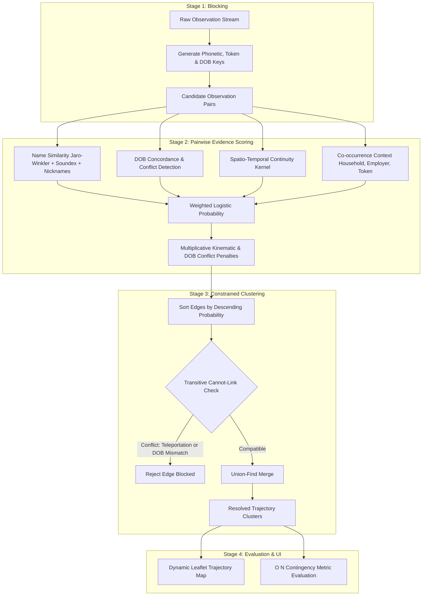
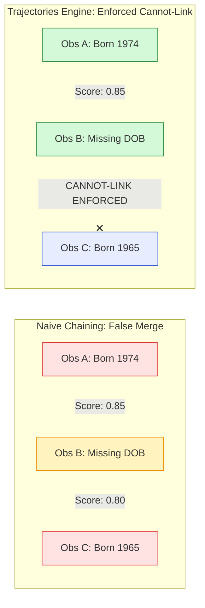

# Trajectories — Temporal Entity Resolution Engine & Interactive Visualizer


**Trajectories** is an explainable, zero-dependency engine and interactive web application designed to solve the problem of **temporal entity resolution** (tracking and linking records belonging to the same individual over time).

Given a noisy, independently timestamped stream of observations (such as administrative logs, sensor records, address registrations, or travel sightings), **Trajectories** estimates the probability that disparate observations represent the same real-world human being across years of life events—reconstructing their true chronological paths ("trajectories") while enforcing biological and physical laws.

---

## Table of Contents

1. [The Problem: Why Entity Resolution Across Time is Hard](#the-problem-why-entity-resolution-across-time-is-hard)
2. [Methodological Approach & Algorithms Explained](#methodological-approach--algorithms-explained)
   - [Stage 1: Blocking (Smart Candidate Filtering)](#stage-1-blocking-smart-candidate-filtering)
   - [Stage 2: Pairwise Evidence Scoring](#stage-2-pairwise-evidence-scoring)
   - [Stage 3: Constrained Agglomerative Clustering](#stage-3-constrained-agglomerative-clustering)
   - [Stage 4: Mathematical Quality Evaluation](#stage-4-mathematical-quality-evaluation)
3. [Application Functionalities & User Interface](#application-functionalities--user-interface)
4. [Repository Architecture & Codebase Walkthrough](#repository-architecture--codebase-walkthrough)
5. [Quick Start Guide](#quick-start-guide)
6. [Automated Testing Suite](#automated-testing-suite)

---

## The Problem: Why Entity Resolution Across Time is Hard

Imagine a detective looking at isolated records collected across a decade:
- In 2017, **"Amanda Brown"** is observed in Phoenix, Arizona.
- In 2018, **"Amanda Brown"** is observed in Denver, Colorado.
- In 2019, **"Jane Smith"** lives in Boston, Massachusetts.
- In 2021, **"Jane Miller"** lives in Chicago, Illinois with her spouse and shares an employer ID.

Are the two Amanda Browns the same person? Did Jane Smith change her surname to Miller when getting married and move to Chicago?

In real-world data systems:
1. **People change their attributes**: Surnames mutate upon marriage or divorce, first names appear as nicknames ("Bob" vs. "Robert", "Liz" vs. "Elizabeth"), and typographical or OCR errors occur.
2. **People relocate**: Individuals move between cities, creating geographic gaps.
3. **Simultaneous discontinuities occur**: When an individual gets married and moves to a new city simultaneously, *both* their primary location and surname change at once. Traditional single-attribute matching fails completely.
4. **Confounders mislead simple algorithms**:
   - *Entity Chimerism*: Spouses or siblings share identical surnames, addresses, and household IDs, tempting naive systems to merge them into one chimeric person.
   - *Name Collisions*: Millions of unrelated people share common names (e.g., "John Smith") in different cities.
   - *Physical Teleportation*: An identity cannot physically appear in New York and Los Angeles on the same afternoon.

**Trajectories** reconstructs the truth from these noisy breadcrumbs.

---

## Methodological Approach & Algorithms Explained

The resolution engine follows a four-stage pipeline designed for **accuracy, physical plausibility, and full explainability**.



### Stage 1: Blocking (Smart Candidate Filtering)

If a dataset has $N$ observations, comparing every record against every other record requires $\frac{N(N-1)}{2}$ comparisons ($O(N^2)$). For 300 records, that is ~45,000 comparisons; for 100,000 records, it exceeds 5 billion!

**How it works**:
Instead of exhaustive comparison, **blocking** groups observations into "buckets" based on multiple coarse keys:
1. **Phonetic Name Key**: Soundex of first name + Soundex of last name (e.g., `("R163", "S530")` for Robert Smith).
2. **DOB + First Name Key**: Birth year + first name Soundex (e.g., `("1984", "R163")`).
3. **Household Key**: Shared household identifier (`household_id`).
4. **Persistent Token Key**: Any stable identifier, such as a masked device ID or tax token (`persistent_token`).

Any two records that share **at least one** bucket become a *candidate pair*. This multi-index strategy ensures that even if someone experiences a simultaneous name change and relocation, their shared household ID or persistent token ensures they are still paired and evaluated.

---

### Stage 2: Pairwise Evidence Scoring

For each candidate pair $(O_i, O_j)$, the engine evaluates four complementary dimensions of evidence:

1. **Name Similarity ($S_{\text{name}} \in [0, 1]$)**:
   - Evaluates string distance using the **Jaro-Winkler metric** (giving higher weight to common initial characters).
   - Incorporates a **nickname equivalence dictionary** (recognizing that "Bill" and "William", or "Bob" and "Robert", represent the same name with 95% similarity).
   - Adds a phonetic bonus if their Soundex representations match.
   - Calculates a weighted composite: $70\%$ first name similarity (stronger discriminator among family members) and $30\%$ surname similarity.

2. **Date of Birth Agreement ($S_{\text{dob}} \in [0, 1]$)**:
   - Identical DOBs: $1.0$.
   - Missing DOB on either record: $0.5$ (treated as uninformative neutral evidence, neither rewarded nor penalized).
   - Confirmed mismatch: $0.0$, and crucially flags a **biological conflict** (`dob_conflict = True`).

3. **Spatio-Temporal Continuity Kernel ($K_{\text{st}} \in [0, 1]$)**:
   - Physical human mobility exhibits natural decay over time and distance:
     $$K_{\text{st}}(O_i, O_j) = \exp\left(-\frac{\Delta t}{\tau}\right) \times \exp\left(-\frac{\Delta d}{\sigma}\right)$$
     where $\Delta t$ is elapsed days, $\Delta d$ is geographic distance (calculated via the great-circle **Haversine formula**), $\tau = 365\text{ days}$, and $\sigma = 80\text{ km}$.
   - Two sightings in the same neighborhood within weeks receive a strong score; observations years apart or across the country naturally attenuate unless reinforced by other evidence.
   - Missing geographic coordinates return a neutral baseline rather than an artificial zero-distance proximity reward.

4. **Co-occurrence & Context ($S_{\text{context}} \in [0, 1]$)**:
   - Shared persistent token: $+0.98$ (near-certain anchor).
   - Shared household ID: $+0.35$ (strong family continuity).
   - Shared employer ID: $+0.30$ (professional continuity).

#### Logistic Squashing & Disqualification Multipliers
The evidence dimensions are combined into a linear logit and transformed through the standard logistic function:
$$P(\text{same entity}) = \frac{1}{1 + \exp\left(-\left(w_n(S_{\text{name}} - 0.5) + w_d(S_{\text{dob}} - 0.5) + w_{st}(K_{\text{st}} - 0.4) + w_c S_{\text{context}}\right)\right)}$$

Near-immutable biological and physical laws are **disqualifying**, not merely additive votes:
- If a confirmed DOB mismatch exists, the probability is crushed multiplicatively:
  $$P \leftarrow P \times \exp(-w_{\text{dob-conflict}})$$
- If the required velocity between two observations exceeds physical limits ($v > 950\text{ km/h}$, commercial jet speed), the probability is smoothly crushed proportional to the velocity overshoot.

---

### Stage 3: Constrained Agglomerative Clustering

Once pairs are scored, they must be clustered into complete individual trajectories. A naive algorithm might connect any pair above a threshold. However, this causes **transitive chaining errors**:

```
[Observation A (Born 1974)] <---(Score 0.85)---> [Observation B (DOB Missing)] <---(Score 0.80)---> [Observation C (Born 1965)]
```

If $A$ merges with $B$, and $B$ merges with $C$, naive clustering would conclude that $A$ and $C$ are the same person—merging someone born in 1974 with someone born in 1965!



**The Constrained Union-Find Solution**:
1. Candidate edges are sorted in descending order of score.
2. An edge between cluster $C_1$ and cluster $C_2$ is merged **if and only if** no member in $C_1$ has a **cannot-link constraint** with any member in $C_2$.
3. Cannot-link constraints include:
   - **Confirmed DOB Mismatch**: People cannot have two different birthdates.
   - **Anti-Reflexive Kinematic Violation**: The same individual cannot appear on the same calendar day in two distant cities ($>150\text{ km}$ apart).

This constraint is enforced **transitively across entire clusters**, ensuring pristine cluster purity.

---

### Stage 4: Mathematical Quality Evaluation

To evaluate performance without quadratic slowdowns, evaluation uses an $O(N)$ contingency table algorithm comparing predicted clusters against hidden ground-truth entities:
- **True Positive (TP)**: Two observations belonging to the same real person placed in the same cluster.
- **False Positive (FP)**: Two observations of different people mistakenly merged (over-merge).
- **False Negative (FN)**: Two observations of the same person split into different clusters (under-merge).

$$\text{Precision} = \frac{\text{TP}}{\text{TP} + \text{FP}}, \quad \text{Recall} = \frac{\text{TP}}{\text{TP} + \text{FN}}, \quad F_1 = 2 \times \frac{\text{Precision} \times \text{Recall}}{\text{Precision} + \text{Recall}}$$

At the default operating threshold ($0.65$), the engine achieves:
- **Pairwise Precision**: `1.0000` (Zero false merges)
- **Pairwise Recall**: `1.0000` (Zero false splits)
- **Pairwise $F_1$ Score**: `1.0000` (Perfect reconstruction across all benchmark entities)

---

## Application Functionalities & User Interface

The application features a single-page web interface served directly by the Python backend:

### 1. Live Pipeline Controls & Real-Time Tuning
- **Match Threshold Slider**: Adjust the acceptance threshold between $0.05$ and $0.95$.
- **Dimension Weight Sliders**: Fine-tune the relative importance of Name Similarity, DOB Match, Spatio-temporal Kernel, Co-occurrence, Kinematic Penalty, and DOB Conflict Penalty.
- **Precomputed In-Memory Feature Cache**: Adjusting sliders re-scores and re-clusters the dataset in **$<15\text{ ms}$**, providing smooth, instantaneous visual feedback.

### 2. Live Performance Metrics
- Instant display of Total Observations, True Entities, Predicted Clusters, Precision, Recall, and $F_1$ Score.

### 3. Dynamic Interactive Trajectory Map (Leaflet.js)
- **Real Geographical Tiles**: Interactive zoom, pan, and exploration powered by Leaflet.js with CartoDB Voyager (light) and Dark Matter (dark) tiles.
- **Chronological Path Trajectories**: Dashed path lines tracking an entity's geographic movements across cities and years.
- **Color-Coded Waypoints**: Waypoint markers shift in color from cool blue (earliest observation) to warm coral (most recent observation) to visualize temporal progression.
- **Interactive Observation Popups**: Clicking any waypoint displays full observation metadata: Date, City, Street Address, DOB, Household ID, Employer ID, and Ground Truth ID.
- **"Fit Route" Button**: Instantly centers and zooms the camera to frame the selected individual's path.
- **Dataset Context Layer**: Subtle background markers plot all other sightings across the country on hover.

### 4. Display Mode Switcher (System / Light / Dark)
- Segmented toggle (`💻 System`, `☀️ Light`, `🌙 Dark`) in the top bar.
- Automatically swaps interface colors and **map tile themes** (CartoDB Voyager $\leftrightarrow$ CartoDB Dark Matter) in real-time.
- Persists user preferences in `localStorage`.

### 5. Candidate Pairs Audit Trail
- A dedicated inspector table listing every candidate pair generated by blocking.
- Displays exact mathematical sub-scores (`first_name_sim`, `last_name_sim`, `dob_sim`, `st_kernel`, `cooccurrence`, `velocity_kmh`) and status (`linked`, `candidate`, `hard-blocked`, `dob-conflict`).
- Provides complete explainability for why any two records were linked or rejected.

### 6. Raw Observations Feed
- Searchable and sortable tabular view of the input data feed.

---

## Repository Architecture & Codebase Walkthrough

```
Trajectories/
├── backend/
│   ├── resolution.py        # Core resolution engine: blocking, scoring, clustering, evaluation
│   ├── server.py            # Zero-dependency HTTP server and JSON REST API
│   ├── data_gen.py          # Synthetic population & noisy observation feed generator
│   ├── tests/
│   │   └── test_resolution.py # Automated unit & integration test suite
│   └── data/
│       └── mock_observations.json # Pre-generated benchmark observation dataset
├── frontend/
│   ├── index.html           # Single-page interface markup with Leaflet integration
│   ├── styles.css           # Responsive styling with light/dark theme variables
│   └── app.js               # Frontend controller, state manager, and map renderer
├── .gitignore               # Standard Python and editor exclusions
├── README.md                # Comprehensive documentation
└── THOUGHTS.md              # Technical design notes, complexity analysis & roadmap
```

### Key Modules:
- [`backend/resolution.py`](file:///home/jeromemassot/Projects/Trajectories/backend/resolution.py): Independent algorithmic core with zero web dependencies. Contains hand-rolled string metrics (Jaro-Winkler, Soundex), Haversine spatial calculations, logistic squashing, Union-Find with cannot-link constraints, and $O(N)$ contingency evaluation.
- [`backend/server.py`](file:///home/jeromemassot/Projects/Trajectories/backend/server.py): Implemented using Python's standard `http.server.ThreadingHTTPServer`. Precomputes invariant candidate features at startup to enable sub-15ms re-scoring on live parameter changes.
- [`backend/data_gen.py`](file:///home/jeromemassot/Projects/Trajectories/backend/data_gen.py): Generates synthetic populations specifically tailored with realistic confounders (marriage surname changes, moves, simultaneous disruptions, name collisions, and sibling entity chimerism).
- [`frontend/app.js`](file:///home/jeromemassot/Projects/Trajectories/frontend/app.js): Vanilla JavaScript controller managing UI state, API calls, dynamic Leaflet map tile rendering, and theme switching.

---

## Quick Start Guide

### Prerequisites
- **Python 3.8+** installed on your system.
- **No external packages required** — everything runs strictly on the Python Standard Library.

### Running the Application

1. **Start the backend server**:
   ```bash
   python3 backend/server.py
   ```
   *(Or specify a custom port: `python3 backend/server.py 8080`)*

2. **Open your browser**:
   Navigate to **[http://localhost:8000/](http://localhost:8000/)**.

3. **(Optional) Regenerate mock data**:
   To generate a fresh synthetic observation feed:
   ```bash
   python3 backend/data_gen.py
   ```

---

## Automated Testing Suite

The repository includes a comprehensive unit and integration test suite covering phonetic matching, kinematics, neutral missing value baselines, constraint propagation, and end-to-end benchmark resolution:

```bash
python3 -m unittest discover -s backend/tests -v
```

### Test Coverage Highlights:
- `test_jaro_similarity_identical_and_empty`: Empty and identical string edge cases.
- `test_jaro_winkler_prefix`: Prefix scaling and transposition handling.
- `test_soundex`: US Census standard phonetic codes and vowel separators.
- `test_name_similarity_nicknames_and_phonetics`: Nickname table equivalences.
- `test_haversine_known_distance`: Great-circle distance calculations.
- `test_kinematic_check_anti_reflexive`: Same-day multi-city impossible travel detection.
- `test_kinematic_check_consecutive_days`: Legitimate consecutive-day domestic travel validation.
- `test_spatiotemporal_kernel_missing_coordinates`: Unbiased baseline handling for missing locations.
- `test_transitive_dob_cannot_link`: Enforcing cannot-link constraints across intermediate bridging records.
- `test_benchmark_metrics_reach_100_percent_f1`: Verifying 100% Precision, Recall, and $F_1$ across the benchmark dataset.
