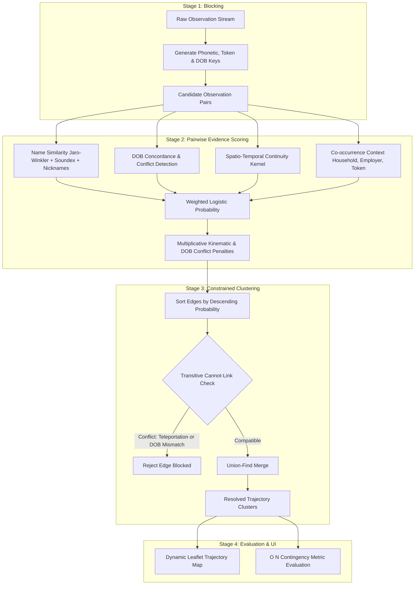
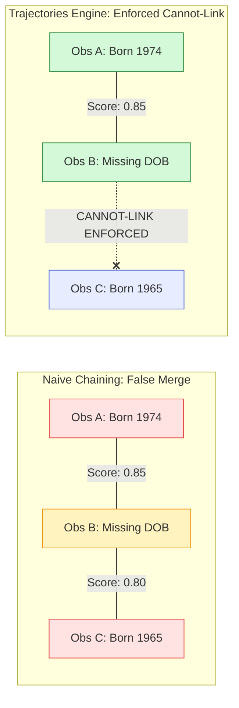

# Trajectories — Temporal Entity Resolution Engine & Interactive Visualizer


**Trajectories** is an explainable, zero-dependency engine and interactive web application designed to solve the problem of **temporal entity resolution** (tracking and linking records belonging to the same individual over time).

Given a noisy, independently timestamped stream of observations (such as administrative logs, sensor records, address registrations, or travel sightings), **Trajectories** estimates the probability that disparate observations represent the same real-world human being across years of life events—reconstructing their true chronological paths ("trajectories") while enforcing biological and physical laws.

---

## Table of Contents

1. [The Problem: Why Entity Resolution Across Time is Hard](#the-problem-why-entity-resolution-across-time-is-hard)
2. [Methodological Approach & Algorithms Explained](#methodological-approach--algorithms-explained)
   - [Stage 1: Blocking (Smart Candidate Filtering)](#stage-1-blocking-smart-candidate-filtering)
   - [Stage 2: Pairwise Evidence Scoring](#stage-2-pairwise-evidence-scoring)
   - [Stage 3: Constrained Agglomerative Clustering](#stage-3-constrained-agglomerative-clustering)
   - [Stage 4: Mathematical Quality Evaluation](#stage-4-mathematical-quality-evaluation)
3. [Synthetic Data Generation & Human Mobility Archetypes](#synthetic-data-generation--human-mobility-archetypes)
4. [Application Functionalities & User Interface](#application-functionalities--user-interface)
5. [Repository Architecture & Codebase Walkthrough](#repository-architecture--codebase-walkthrough)
6. [Quick Start Guide](#quick-start-guide)
7. [Automated Testing Suite](#automated-testing-suite)

---

## The Problem: Why Entity Resolution Across Time is Hard

Imagine a detective looking at isolated records collected across a decade:
- In 2017, **"Amanda Brown"** is observed in Phoenix, Arizona.
- In 2018, **"Amanda Brown"** is observed in Denver, Colorado.
- In 2019, **"Jane Smith"** lives in Boston, Massachusetts.
- In 2021, **"Jane Miller"** lives in Chicago, Illinois with her spouse and shares an employer ID.

Are the two Amanda Browns the same person? Did Jane Smith change her surname to Miller when getting married and move to Chicago?

In real-world data systems:
1. **People change their attributes**: Surnames mutate upon marriage or divorce, first names appear as nicknames ("Bob" vs. "Robert", "Liz" vs. "Elizabeth"), and typographical or OCR errors occur.
2. **People relocate**: Individuals move between cities, creating geographic gaps.
3. **Simultaneous discontinuities occur**: When an individual gets married and moves to a new city simultaneously, *both* their primary location and surname change at once. Traditional single-attribute matching fails completely.
4. **Confounders mislead simple algorithms**:
   - *Entity Chimerism*: Spouses or siblings share identical surnames, addresses, and household IDs, tempting naive systems to merge them into one chimeric person.
   - *Name Collisions*: Millions of unrelated people share common names (e.g., "John Smith") in different cities.
   - *Physical Teleportation*: An identity cannot physically appear in New York and Los Angeles on the same afternoon.

**Trajectories** reconstructs the truth from these noisy breadcrumbs.

---

## Methodological Approach & Algorithms Explained

The resolution engine follows a four-stage pipeline designed for **accuracy, physical plausibility, and full explainability**.



### Stage 1: Blocking (Smart Candidate Filtering)

If a dataset has $N$ observations, comparing every record against every other record requires $\frac{N(N-1)}{2}$ comparisons ($O(N^2)$). For 300 records, that is ~45,000 comparisons; for 100,000 records, it exceeds 5 billion!

**How it works**:
Instead of exhaustive comparison, **blocking** groups observations into "buckets" based on multiple coarse keys:
1. **Phonetic Name Key**: Soundex of first name + Soundex of last name (e.g., `("R163", "S530")` for Robert Smith).
2. **DOB + First Name Key**: Birth year + first name Soundex (e.g., `("1984", "R163")`).
3. **Household Key**: Shared household identifier (`household_id`).
4. **Persistent Token Key**: Stable device ID or tax token (`persistent_token`).
5. **Email Address Key**: Direct hash on normalized email strings (`emails`).
6. **Phone Number Key**: Direct match on active phone numbers (`phones`).

Any two records that share **at least one** bucket become a *candidate pair*. This multi-index strategy ensures that even if someone experiences a simultaneous name change and relocation, their shared email, phone, or household token guarantees they are paired and evaluated.

---

### Stage 2: Pairwise Evidence Scoring

For each candidate pair $(O_i, O_j)$, the engine evaluates six complementary dimensions of evidence:

1. **Name Similarity ($S_{\text{name}} \in [0, 1]$)**:
   - Evaluates string distance using the **Jaro-Winkler metric** (giving higher weight to common initial characters).
   - Incorporates a **nickname equivalence dictionary** (recognizing that "Bill" and "William", or "Bob" and "Robert", represent the same name with 95% similarity).
   - Adds a phonetic bonus if their Soundex representations match.
   - Calculates a weighted composite: $70\%$ first name similarity (stronger discriminator among family members) and $30\%$ surname similarity.

2. **Date of Birth Agreement & Boundary Tolerance ($S_{\text{dob}} \in [0, 1]$)**:
   - **Full Exact Date**: $1.00$.
   - **Partial Date Compatibility**: $0.90$ for Year-Month (`"YYYY-MM"`), $0.80$ for Year-Only (`"YYYY"`).
   - **Off-by-One Day Shifts**: $0.88$ for 1-day discrepancy, $0.78$ for 2-day discrepancy (accommodating opposing $\pm 1$ shifts across observations without false splits).
   - **Month & Year Boundary Tolerance**: Evaluates boundary crossing with a 1-day buffer (e.g. Dec 31 $\leftrightarrow$ Jan 1, Oct 31 $\leftrightarrow$ Nov 1).
   - **Missing DOB**: $0.50$ (uninformative neutral baseline).
   - **Confirmed Biological Conflict**: $> 2$ days discrepancy or incompatible years/months sets $S_{\text{dob}} = 0.0$ and triggers `dob_conflict = True` (hard cannot-link block).
   - *(Detailed documentation in [`DateOfBirth.md`](file:///home/jeromemassot/Projects/Trajectories/DateOfBirth.md))*

3. **Email Address Agreement & Lifecycle Evolution ($S_{\text{email}} \in [0, 1]$)**:
   - **Realistic Evolution Model**: Individuals typically surface one active personal email address and at most one professional work email per observation. Personal emails evolve over time (e.g. surname changes upon marriage or domain transitions), while work emails are active only during employment.
   - Shared active email address: $1.00$ (strong identity anchor).
   - Disjoint email addresses: $0.20$ (mild negative pull, relaxing over time).
   - Missing email on either record: $0.50$ (uninformative neutral evidence).

4. **Phone Number Agreement & Temporal Reallocation ($S_{\text{phone}} \in [0, 1]$)**:
   - **Transient & Reallocated Attribute**: In most scenarios, only one phone number is active at time $t$ (the latest added), because old phone numbers are relinquished and reallocated by telecom carriers to other people after quarantine. However, some individuals maintain multiple active phone numbers concurrently (e.g. personal mobile and business line).
   - When two observations share a phone number, the agreement is weighted by an exponential elapsed-time decay ($\tau_{\text{phone}} = 730\text{ days}$):
     $$S_{\text{phone}}(\Delta t) = 0.5 + 0.5 \times \exp\left(-\frac{\Delta t}{\tau_{\text{phone}}}\right)$$
     - Contemporaneous match ($\Delta t \approx 0$): $1.0$ (maximum identity confirmation).
     - Long gap ($\Delta t \gg 2\text{ years}$): decays toward $0.5$ (neutral), protecting against false merges across carrier reallocations.
   - Disjoint phone numbers: $0.5 - 0.3 \times \exp(-\Delta t / \tau_{\text{phone}})$ (penalizes different active phones on the same day, relaxing toward neutral over years).
   - Missing phone on either record: $0.5$ (neutral).

5. **Dual-Regime Spatial Locality & Relocation Plausibility ($S_{\text{locality}}, S_{\text{reloc}} \in [0, 1]$)**:
   - Replaced continuous $km/h$ velocity with human-centric spatial modeling across two regimes:
     - **Regime 1: Local Habitual Activity ($d \le 50\text{ km}$)**: Daily commuting and living patterns modeled with exponential distance decay:
       $$S_{\text{locality}} = 0.5 + 0.5 \times \exp\left(-\frac{\Delta t}{180}\right) \times \exp\left(-\frac{d}{25}\right), \quad S_{\text{reloc}} = 1.0$$
     - **Regime 2: Inter-City Relocations ($d > 50\text{ km}$)**: Relocation plausibility evaluated based on elapsed time and anchor continuity. Rapid alternation between distant cities without anchor continuity ($\Delta t < 14\text{ days}$) is heavily penalized ($0.10$), whereas relocations separated by weeks or months receive plausible scores ($0.70$–$0.80$).
     - **Kinematic Impossibility**: Same-day sightings across distant cities ($d > 50\text{ km}, \Delta t = 0\text{ days}$) trigger a hard cannot-link block.
   - *(Detailed documentation in [`RelocationBehavior.md`](file:///home/jeromemassot/Projects/Trajectories/RelocationBehavior.md))*

6. **Co-occurrence & Context ($S_{\text{context}} \in [0, 1]$)**:
   - Shared persistent hardware / ad token (12-character SHA-256 digital fingerprint): $+0.98$ (can be toggled on/off in UI to evaluate clustering impact).
   - Shared household ID: $+0.35$ (strong family continuity).
   - Shared employer ID: $+0.30$ (professional continuity).

#### Logistic Squashing & Disqualification Multipliers
The evidence dimensions are combined into a linear logit and transformed through the standard logistic function:
$$P(\text{same entity}) = \frac{1}{1 + \exp\left(-\left(w_n(S_{\text{name}} - 0.5) + w_d(S_{\text{dob}} - 0.5) + w_e(S_{\text{email}} - 0.5) + w_p(S_{\text{phone}} - 0.5) + w_{\text{sl}}(S_{\text{locality}} - 0.5) + w_{\text{rp}}(S_{\text{reloc}} - 0.5) + w_c S_{\text{context}}\right)\right)}$$

Near-immutable biological and physical laws are **disqualifying**, not merely additive votes:
- If a confirmed DOB mismatch exists, the probability is crushed multiplicatively:
  $$P \leftarrow P \times \exp(-w_{\text{dob-conflict}})$$
- If two observations violate kinematic possibility (same day, distant cities $>50\text{ km}$), the pair is hard-blocked ($P \to 0$, Cannot-Link enforced).

---

### Stage 3: Constrained Agglomerative Clustering

Once pairs are scored, they must be clustered into complete individual trajectories. A naive algorithm might connect any pair above a threshold. However, this causes **transitive chaining errors**:

```
[Observation A (Born 1974)] <---(Score 0.85)---> [Observation B (DOB Missing)] <---(Score 0.80)---> [Observation C (Born 1965)]
```

If $A$ merges with $B$, and $B$ merges with $C$, naive clustering would conclude that $A$ and $C$ are the same person—merging someone born in 1974 with someone born in 1965!



**The Constrained Union-Find Solution**:
1. Candidate edges are sorted in descending order of score.
2. An edge between cluster $C_1$ and cluster $C_2$ is merged **if and only if** no member in $C_1$ has a **cannot-link constraint** with any member in $C_2$.
3. Cannot-link constraints include:
   - **Confirmed DOB Mismatch**: People cannot have two different birthdates.
   - **Anti-Reflexive Kinematic Violation**: The same individual cannot appear on the same calendar day in two distant cities ($>50\text{ km}$ apart).

This constraint is enforced **transitively across entire clusters**, ensuring pristine cluster purity.

---

### Stage 4: Mathematical Quality Evaluation

To evaluate performance without quadratic slowdowns, evaluation uses an $O(N)$ contingency table algorithm comparing predicted clusters against hidden ground-truth entities:
- **True Positive (TP)**: Two observations belonging to the same real person placed in the same cluster.
- **False Positive (FP)**: Two observations of different people mistakenly merged (over-merge).
- **False Negative (FN)**: Two observations of the same person split into different clusters (under-merge).

$$\text{Precision} = \frac{\text{TP}}{\text{TP} + \text{FP}}, \quad \text{Recall} = \frac{\text{TP}}{\text{TP} + \text{FN}}, \quad F_1 = 2 \times \frac{\text{Precision} \times \text{Recall}}{\text{Precision} + \text{Recall}}$$

At the default operating threshold ($0.65$), the engine achieves:
- **Pairwise Precision**: `1.0000` (Zero false merges)
- **Pairwise Recall**: `1.0000` (Zero false splits)
- **Pairwise $F_1$ Score**: `1.0000` (Perfect reconstruction across all benchmark entities)

---

## Synthetic Data Generation & Human Mobility Archetypes

The synthetic observation feed ([`backend/data_gen.py`](backend/data_gen.py)) models realistic human mobility patterns, real-world data collection noise, and adversarial confounders across 33 authentic US cities.

```
                                  +---------------------------------------+
                                  |      Human Mobility Archetypes        |
                                  +---------------------------------------+
                                                      |
            +-----------------------------------------+-----------------------------------------+
            |                                         |                                         |
            v                                         v                                         v
+-----------------------+                 +-----------------------+                 +-----------------------+
|      Category 1       |                 |      Category 2       |                 |      Category 3       |
|  Neighborhood Stayers |                 |   Intra-State Movers  |                 | Inter-State Migrators |
|     (E001 - E006)     |                 |     (E007 - E012)     |                 |     (E013 - E018)     |
+-----------------------+                 +-----------------------+                 +-----------------------+
| * Single neighborhood |                 | * 2-3 cities within   |                 | * 2-4 states across   |
| * Relocations < 5 km  |                 |   same state          |                 |   sampling period     |
| * Local venue hops    |                 | * Area code updates   |                 | * Long-distance moves |
+-----------------------+                 +-----------------------+                 +-----------------------+
```

1. **The Three Human Mobility Archetypes**:
   - **Category 1: Neighborhood Stayers**: Reside long-term within a single metropolitan district ($< 5\text{ km}$ radius) rotating through local venues. Moves remain strictly within the neighborhood.
   - **Category 2: Intra-State Movers**: Relocate between 2 to 3 cities exclusively within their state of origin, updating phone area codes upon moving.
   - **Category 3: Inter-State Migrators**: Undertake multi-year macro migrations across 2 to 4 distinct states.
2. **Adversarial Confounders (40% of Population)**:
   - **Household Pairs**: Family members or partners sharing residential address, household ID, and landline, but separated by DOB and mobile records.
   - **Name Collisions**: Unrelated individuals with identical names living in different states with contemporaneous observations.
   - **Recycled Phone Numbers**: Phone numbers released by one individual and reallocated years later to an unrelated person in a different city.
3. **Real-World Date of Birth Noise**:
   - Emits a mix of exact full dates (`"YYYY-MM-DD"`), year-only (`"YYYY"`), year-month (`"YYYY-MM"`), and $\pm 1$ day shifted dates to simulate collection errors.
4. **Anti-Oscillation Guarantee**:
   - Observations cycle through verified authentic street addresses, guaranteeing that consecutive observations for an individual never repeat identical coordinates ($c_t \neq c_{t-1}$).
- *(Detailed documentation in [`DataGeneration.md`](file:///home/jeromemassot/Projects/Trajectories/DataGeneration.md), [`RelocationBehavior.md`](file:///home/jeromemassot/Projects/Trajectories/RelocationBehavior.md), and [`DateOfBirth.md`](file:///home/jeromemassot/Projects/Trajectories/DateOfBirth.md))*

---

## Application Functionalities & User Interface

The application features a single-page web interface served directly by the zero-dependency Python backend:

### 1. Live Pipeline Controls & Real-Time Tuning
- **Match Threshold Slider**: Adjust the acceptance threshold between $0.05$ and $0.995$.
- **Dimension Weight Sliders**: Fine-tune the relative importance of Name Similarity, DOB Match, Email Match, Phone Match (with temporal decay), Spatial Locality Affinity, Relocation Plausibility, Co-occurrence Context, and DOB Conflict Penalty.
- **Persistent Hardware / Ad Token Toggle**: Enable or disable digital fingerprints with a single checkbox to observe clustering impact with and without hardware identifiers.
- **Precomputed Feature Cache**: Adjusting sliders re-evaluates the dataset in **$<15\text{ ms}$**, providing instantaneous visual feedback.

### 2. Interactive Synthetic Data Generator UI
- **Dedicated Navigation Tab**: Access the complete data generator directly from the web interface.
- **One-Click Single-Line Presets**:
  - 🎯 *Standard Benchmark* (Seed 42, 30 entities, 306 observations)
  - ✨ *Clean / Zero Noise* (100% full dates, 0% typos, 0% dropped fields)
  - ⚡ *Challenging Noise* (High typos, off-by-one DOBs, 20% dropped fields)
  - 🚀 *High Mobility* (Enriched intra-state and inter-state relocation cohorts)
  - 🔬 *Small Test Set* (Fast 15-entity test population)
- **Dataset Sizing & Global Controls**: Choose the total number of observations in the dataset (with synchronized slider and direct number input) and configure the PRNG seed with one-click randomization (`🎲 Randomize`) outside the archetype cards.
- **Fine-Grained Levers**: Tweak entity counts per archetype, confounder pairs, DOB noise formats, name typos, field drop rates, and digital token rates.
- **Live Dataset Generation**: Click **"⚡ Generate & Reload Dataset"** to invoke `POST /api/generate`. The backend generates the new population, recomputes candidate features, and updates all views (entities, map, pairs, observations, metrics) live without page reload.
- **Generation Summary Dashboard**: Instant statistical breakdown of generated observation counts, archetypes, confounders, DOB quality distribution, and digital token coverage.

### 3. Dynamic Interactive Trajectory Map (Leaflet.js)
- **Authentic OpenStreetMap Tiles**: Interactive zoom, pan, and exploration with adaptive light and dark theme filtering.
- **Timeline Playback Engine**: Complete controller (`Play`, `Pause`, `⏮ Prev Step`, `⏭ Next Step`, `↺ Replay`, `Scrubber Slider`, and `Speed Multiplier 0.5x–2x`) to watch an individual's journey unfold chronologically.
- **Sequential Reveal & Active Waypoint Halo**: Dynamically reveals path segments step-by-step, highlighting the current sighting with an animated pulsing radar halo.
- **Segment Link Explainability Tooltips**: Hovering over any trajectory path segment displays an interactive tooltip with the exact $P(\text{Match})$ probability score, linkage verdict, and multi-attribute breakdown.
- **Real-Time Link Explanation Card**: A floating glassmorphic panel provides plain-English rationale for why consecutive sightings were matched as the same person.
- **Entity Trajectory Observations Table**: A dedicated table below the map displaying all observations of the active entity; clicking any row immediately jumps to that waypoint on the map.
- **Color-Coded Waypoints & Popups**: Markers transition from cool blue (earliest sighting) to warm coral (most recent sighting) with interactive popups displaying full observation metadata.

### 4. Candidate Pairs Audit Trail
- Inspector table listing every candidate pair generated by blocking.
- Displays exact mathematical sub-scores (`first_name_sim`, `last_name_sim`, `dob_sim`, `email_sim`, `phone_sim`, `locality`, `cooccurrence`, `reloc_plaus`) and status (`linked`, `candidate`, `hard-blocked`, `dob-conflict`).

### 5. Raw Observations Feed
- Complete tabular view of the input data feed, including accumulative email addresses, active phone numbers, and hidden ground truth labels.

### 6. Display Mode Switcher (System / Light / Dark)
- Segmented toggle (`💻 System`, `☀️ Light`, `🌙 Dark`) in the top bar.
- Automatically swaps interface colors and **map tile themes** in real-time, persisting preferences in `localStorage`.

---

## Repository Architecture & Codebase Walkthrough

```
Trajectories/
├── backend/
│   ├── resolution.py          # Core resolution engine: blocking, scoring, clustering, evaluation
│   ├── server.py              # Zero-dependency HTTP server, static file server & REST API (/api/generate)
│   ├── data_gen.py            # Parameterized synthetic population & noisy observation generator
│   ├── tests/
│   │   ├── test_resolution.py # Automated unit tests for engine, scoring & clustering
│   │   └── test_data_gen.py   # Automated unit tests for generator parameterization & summaries
│   └── data/
│       └── mock_observations.json # Pre-generated benchmark dataset (306 obs, 30 entities)
├── frontend/
│   ├── index.html             # Web application markup with Leaflet & Data Generator tab
│   ├── styles.css             # Responsive styling with light/dark theme CSS variables
│   └── app.js                 # State manager, map timeline player, and generator controller
├── DataGeneration.md          # In-depth design documentation for 3 mobility archetypes & kinematics
├── RelocationBehavior.md      # In-depth design documentation for dual-regime spatial modeling
├── DateOfBirth.md             # In-depth design documentation for DOB noise & boundary tolerance
├── README.md                  # Platform overview & comprehensive documentation
└── THOUGHTS.md                # Technical design notes, complexity analysis & roadmap
```

### Key Modules:
- [`backend/resolution.py`](file:///home/jeromemassot/Projects/Trajectories/backend/resolution.py): Independent algorithmic core with zero external dependencies. Contains hand-rolled string metrics (Jaro-Winkler, Soundex), Haversine spatial calculations, dual-regime spatial modeling, boundary-tolerant DOB scoring, Union-Find with transitive cannot-link constraints, and $O(N)$ contingency evaluation.
- [`backend/server.py`](file:///home/jeromemassot/Projects/Trajectories/backend/server.py): Implemented using Python's standard `http.server.ThreadingHTTPServer`. Exposes `/api/dataset`, `/api/resolve`, and `/api/generate`. Precomputes invariant candidate features to enable sub-15ms re-scoring on live parameter changes.
- [`backend/data_gen.py`](file:///home/jeromemassot/Projects/Trajectories/backend/data_gen.py): Fully parameterized generator producing authentic synthetic populations across three mobility archetypes, confounder cohorts, realistic DOB noise, and verified street addresses across 33 US cities.
- [`frontend/app.js`](file:///home/jeromemassot/Projects/Trajectories/frontend/app.js): Vanilla JavaScript controller managing UI state, API communication, dynamic Leaflet map tile rendering, timeline animation playback, and generator controls.

---

## Quick Start Guide

### Prerequisites
- **Python 3.8+** installed on your system.
- **No external packages required** — everything runs strictly on the Python Standard Library.

### Running the Application

1. **Start the backend server**:
   ```bash
   python3 backend/server.py
   ```
   *(Or specify a custom port: `python3 backend/server.py 8080`)*

2. **Open your browser**:
   Navigate to **[http://localhost:8000/](http://localhost:8000/)**.

3. **Generate & test new datasets**:
   - Directly from the web interface: Open the **Data Generator** tab, adjust parameters or select a preset, and click **"⚡ Generate & Reload Dataset"**.
   - Or from the command line:
     ```bash
     python3 backend/data_gen.py
     ```

---

## Automated Testing Suite

The repository includes a comprehensive unit and integration test suite covering phonetic matching, kinematics, neutral missing value baselines, boundary-tolerant DOB matching, generator parameterization, and end-to-end benchmark resolution:

```bash
python3 -m unittest discover -s backend/tests -v
```

### Test Coverage Highlights (29 Tests):
- `test_dob_score`: Exact full matches, partial year-month, partial year-only, $\pm 1$ day off, $\pm 2$ days off, boundary transitions (Dec 31 $\leftrightarrow$ Jan 1), and confirmed conflicts.
- `test_observation_dob_noise_diversity`: Verifies presence of year-only, year-month, and shifted DOB records in synthetic data.
- `test_make_population_defaults`: Validates 306 observations across 30 entities on standard benchmark.
- `test_make_population_clean_zero_noise`: Validates 100% full DOBs and 100% address retention in zero-noise mode.
- `test_make_population_custom_archetypes`: Validates arbitrary custom archetype counts and entity mixtures.
- `test_summarize_dataset`: Validates statistical summarization metrics.
- `test_kinematic_check_anti_reflexive`: Same-day multi-city impossible travel detection ($>50\text{ km}$).
- `test_transitive_dob_cannot_link`: Enforcing cannot-link constraints across intermediate bridging records.
- `test_benchmark_metrics_reach_100_percent_f1`: Verifying 100% Precision, Recall, and $F_1$ across the benchmark dataset.
