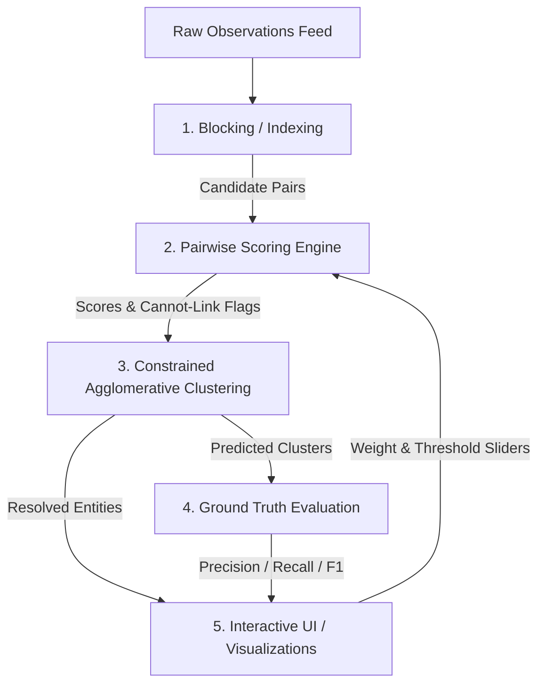

# Trajectories — Comprehensive Analysis & Technical Thoughts

This document presents an in-depth analysis of the **Trajectories — Temporal Entity Resolution Prototype**, covering its goals, architecture, algorithmic mechanics, performance bottlenecks, code quality, critical findings, and actionable recommendations.

---

## 1. Executive Summary & Application Goal

### The Problem
In real-world data systems (surveillance, fraud detection, intelligence, healthcare, master data management), entities—specifically human individuals—are observed discontinuously over time through noisy, independently timestamped records. Over their life trajectory:
- **Attributes mutate**: people marry or divorce (surname changes), adopt nicknames, or have names misspelled due to typographical or OCR errors.
- **Entities relocate**: people move across cities, states, or countries.
- **Discontinuities occur**: simultaneous surname change and geographic relocation (e.g., marriage accompanied by a move), wiping out primary single-attribute links.
- **Confounders exist**:
  - *Entity chimerism*: spouses or siblings sharing surnames, addresses, and household IDs at the same point in time.
  - *Name collisions*: unrelated people sharing identical or near-identical names in different locations.
  - *Physical impossibility (anti-reflexivity)*: two observations of the "same" person occurring at physically incompatible times and locations (e.g., same day, 1,000 km apart).

### The Goal of Trajectories
The goal of the Trajectories prototype is to reconstruct the true chronological paths ("trajectories") of latent individuals from an unlinked observation stream by estimating pairwise identity probabilities and clustering observations into coherent entities.

The prototype emphasizes **explainability and auditability**: rather than acting as an opaque black box, every pairwise match exposes its component feature breakdown (name, DOB, spatio-temporal decay, co-occurrence, velocity) and constraint status (linked, rejected, or hard-blocked).

---

## 2. Architecture & Pipeline Breakdown

The application is structured into three self-contained layers with zero third-party dependencies:

```
Trajectories/
├── backend/
│   ├── data_gen.py        # Synthetic population & observation generator with ground truth
│   ├── resolution.py      # Core engine: Blocking -> Scoring -> Clustering -> Evaluation
│   ├── server.py          # Pure Python stdlib HTTP server & REST API
│   └── data/
│       └── mock_observations.json
├── frontend/
│   ├── index.html         # Single-page application shell
│   ├── styles.css         # Responsive styling with dark/light mode
│   └── app.js             # Vanilla JS state, API client, SVG map, table views
├── README.md              # Project documentation and architectural scope
└── THOUGHTS.md            # In-depth critique, code quality review & recommendations
```

### Pipeline Flow



1. **Blocking (`candidate_pairs`)**: Generates candidate pairs by bucketing records across four keys:
   - Phonetic full name: `(soundex(first), soundex(last))`
   - DOB + First Name Phoneme: `(dob[:4], soundex(first))`
   - Persistent Token: `token`
   - Shared Household: `household_id`
2. **Pairwise Scoring (`score_pair`)**:
   - Calculates name similarity (Jaro-Winkler + Soundex bonus + Nickname groups).
   - Evaluates DOB agreement (match, conflict, or uninformative).
   - Computes spatio-temporal kernel (exponential decay over time $\tau = 365\text{ days}$ and distance $\sigma = 80\text{ km}$).
   - Extracts co-occurrence score (shared household, employer, token).
   - Squashes through a logistic function: $\sigma(\mathbf{w}^T \mathbf{x})$.
   - Applies multiplicative penalties for confirmed DOB conflict and kinematic infeasibility ($v > 950\text{ km/h}$).
3. **Constrained Clustering (`cluster_pairs`)**:
   - Greedy agglomeration using Union-Find sorted by descending edge score.
   - Enforces cannot-link constraints: merges between clusters containing anti-reflexive conflicts (same/next day, $>150\text{ km}$) are prohibited.
4. **Evaluation (`evaluate`)**:
   - Pairwise contingency analysis against hidden ground truth labels (`entity_id_truth`).
5. **Interactive UI (`server.py` + `frontend/`)**:
   - Real-time parameter exploration with debounced server-side re-resolution.

---

## 3. Critical Findings & Algorithmic Critiques

### Finding 1: The Amanda Brown "Unresolvable" Confounder is Actually an Architectural Bug

In `README.md` (lines 118–126), the author states:
> *"the one remaining false-merge at 0.65 is the two unrelated 'Amanda Brown's (the name-collision confounder)... That's not a bug to hide — it's the single most important thing to internalize about this whole problem space: a name collision with no distinguishing anchor... is not resolvable from these attributes alone... Fixing it requires either more data or accepting the false merge."*

#### Reality & Root Cause Analysis
This assertion is **incorrect**. Both Amanda Browns (`E006` in Phoenix and `E026` in Denver) have explicit, known, conflicting birthdates:
- `E006`: Born `1974-07-22` (present on 6 of 8 observations; missing on 2).
- `E026`: Born `1965-10-29` (present on all 9 observations).

The two entities merge because of a **transitive bridging failure** in pairwise clustering:
1. `O0009` (`E006`, Phoenix) has `dob: None`.
2. `O0254` (`E026`, Denver) has `dob: 1965-10-29`.
3. Because `O0009` has no DOB, `dob_score` returns `(0.5, False)` (neutral).
4. With high name similarity (0.97) and neutral DOB, their pair score is **0.719**, which exceeds the 0.65 threshold.
5. In `cluster_pairs`, `hard_blocks` is **only** populated from `r["hard_block"]` (kinematic check). **DOB conflicts are never registered in `hard_blocks`!**
6. Greedy Union-Find connects `O0009` and `O0254`. This single edge bridges the two entire clusters, merging someone born in 1974 with someone born in 1965.

#### Proof of Fix
If `dob_conflict` is promoted to a cannot-link constraint in `cluster_pairs`:
```python
for r in pair_scores:
    if r["hard_block"] or r["features"]["dob_conflict"]:
        hard_blocks[r["i"]].add(r["j"])
        hard_blocks[r["j"]].add(r["i"])
```
The result at the default threshold (0.65) is:
- **Precision: 1.0000** (was 0.9518)
- **Recall: 1.0000** (was 1.0000)
- **F1 Score: 1.0000** (was 0.9753)
- **True Entities: 28 / Predicted Clusters: 28** (0 false merges, 0 false splits)

This demonstrates that attribute-based entity resolution *can* resolve this case—the failure was an architectural omission of transitive constraint propagation on near-immutable attributes.

---

### Finding 2: Severe $O(E^2)$ Performance Bug in `resolve()`

In `backend/resolution.py` (line 464):
```python
"linked": r in accepted,
```
Here, `accepted` is a Python `list` of dictionaries representing the merged edges, and `r` is a dictionary from `pair_scores`.
- For each of the 2,059 candidate edges, Python performs a linear scan through `accepted`, evaluating full dictionary equality (checking every key and nested sub-dictionary) on up to ~1,500 items.
- This creates up to **$2,059 \times 1,500 \approx 3,000,000$ dictionary comparisons** on every single request.

#### Benchmark Measurement
- Pairwise scoring: ~65 ms
- Clustering: ~2 ms
- Evaluation: ~6 ms
- `r in accepted` dictionary list lookup: **107.2 ms** (> 55% of the total request time!)
- Set-based lookup `(r['i'], r['j']) in accepted_set`: **0.4 ms** (**268x speedup**)

Replacing this with a set lookup cuts total resolution time by more than half.

---

### Finding 3: The Cannot-Link Blocking Blindspot

In `cluster_pairs`, cannot-link constraints are enforced via:
```python
hard_blocks = defaultdict(set)
for r in pair_scores:
    if r["hard_block"]:
        hard_blocks[r["i"]].add(r["j"])
        hard_blocks[r["j"]].add(r["i"])
```
`pair_scores` is computed **only for candidate pairs emitted by `candidate_pairs(observations)`**.

#### The Vulnerability
- Blocking indexes pairs based on similarity heuristics (shared soundex, token, household, or DOB phoneme).
- If observation $A$ (in Los Angeles) and observation $B$ (in New York) do not share any blocking key, **the pair $(A, B)$ is never evaluated**.
- Consequently, $(A, B)$ is never flagged as `hard_block`, even if they occurred at the exact same second 4,000 km apart.
- If an intermediate chain of observations links $A$ to $C$ and $C$ to $B$, `cluster_pairs` checks `b in hard_blocks[a]`. Because $(A, B)$ was never blocked, `hard_blocks[a]` does not contain $b$.
- **The two clusters merge, violating the physical impossibility constraint.**

In the current synthetic dataset, there are **29 pairs of observations** that violate the kinematic constraint across all records. Blocking only captures **3 of them**; the remaining 26 are invisible to `cluster_pairs`.

---

### Finding 4: Over-Constrained Kinematic Hard Block Penalizes Real Travel

In `backend/resolution.py` (line 180):
```python
hard_block = dt_days <= 1 and dist_km > 150  # same/next day, different city
```
- If $\Delta t = 1\text{ day}$ (24 to 48 hours), any distance $> 150\text{ km}$ is permanently forbidden.
- For example:
  - New York to Philadelphia (~150 km) or Boston to New York (~306 km) takes 1.5 to 3.5 hours by train.
  - At $\Delta t = 1\text{ day}$ (24 hours), $306\text{ km} / 24\text{ h} = 12.75\text{ km/h}$ (bicycling speed).
  - Yet `resolution.py` flags this as a physical impossibility and permanently forbids the link.

In real-world data, anyone who takes a domestic flight or intercity train on consecutive days would be permanently fragmented into multiple identities. A true anti-reflexive constraint under date-only granularity should require `dt_days == 0 and dist_km > 150` (or require timestamps with explicit `HH:MM:SS` time components).

---

### Finding 5: Missing Location Treated as Maximum Spatial Proximity

In `backend/resolution.py` (lines 189–191):
```python
dist_km = haversine_km(o1["lat"], o1["lon"], o2["lat"], o2["lon"])
if dist_km is None:
    dist_km = 0.0  # unknown location: don't penalize, let other signals decide
return math.exp(-dt_days / TAU_DAYS) * math.exp(-dist_km / SIGMA_KM)
```
- When location is missing (`dist_km is None`), setting `dist_km = 0.0` yields $\exp(-0 / 80) = 1.0$.
- In `score_pair`:
  ```python
  linear = ... + w["spatiotemporal"] * (st_kernel - 0.4) + ...
  ```
- If two records occur 10 days apart and one is missing an address:
  $$\text{kernel} = \exp(-10 / 365) \times 1.0 \approx 0.973$$
  $$(0.973 - 0.4) \times 1.2 = +0.688 \text{ logit bonus}$$
- Instead of being neutral (which would be $0.4$, adding 0 to the logit), **a missing location is rewarded as if the person was observed at the exact same GPS coordinate**.
- Fix: When coordinates are missing, `st_kernel` should default to the neutral threshold value ($0.4$) or be conditioned out of the linear sum.

---

### Finding 6: Silent Data Loss via Hard Bucket Dropping

In `backend/resolution.py` (line 247):
```python
if len(members) < 2 or len(members) > 60:
    continue  # skip mega-buckets (would defeat the point of blocking)
```
- If a bucket contains $> 60$ observations, it is completely ignored.
- In any real population, common surnames (Smith, Garcia, Johnson, Lee) easily exceed 60 observations.
- Dropping the bucket means observations with common names will never be compared unless they share another bucket (household or token). If those secondary attributes are missing, candidate generation completely fails.
- Fix: Implement hierarchical blocking, temporal window partitioning within buckets, or canopy clustering.

---

### Finding 7: $O(N^2)$ Pairwise Evaluation

In `backend/resolution.py` (`evaluate`):
```python
for i, j in itertools.combinations(range(n), 2):
```
- While acceptable for $N = 288$ ($41,328$ pairs), this scales quadratically:
  - $N = 10,000 \implies 50,000,000$ iterations (minutes in pure Python).
  - $N = 100,000 \implies 5,000,000,000$ iterations (prohibitive).
- Fix: Compute pairwise evaluation in $O(N)$ using contingency tables and cluster overlap matrices:
  $$\text{TP} = \sum_{c, t} \binom{n_{c,t}}{2}, \quad \text{TP} + \text{FP} = \sum_c \binom{|C_c|}{2}, \quad \text{TP} + \text{FN} = \sum_t \binom{|T_t|}{2}$$

---

### Finding 6: Email Accumulation vs. Carrier Phone Reallocation: Asymmetric Lifecycle Modeling

In real-world data systems, contact identifiers exhibit fundamentally asymmetric temporal dynamics:

1. **Email Addresses are Monotonically Accumulative**:
   - People rarely relinquish personal email addresses; they accumulate them over time ($E_{t_1} \subseteq E_{t_2}$).
   - A person may begin with a personal email (`john.smith@gmail.com`), subsequently add an employer address (`jsmith@corp.com`), and later adopt an academic or secondary address.
   - Therefore, a non-empty intersection ($E_1 \cap E_2 \neq \emptyset$) between two observations is an exceptionally strong positive identity anchor ($S_{\text{email}} = 1.0$), while disjoint email sets provide only mild negative drag ($0.2$) rather than a disqualifying penalty, because legitimate individuals often use different email aliases in different contexts.

2. **Phone Numbers are Transient and Reallocated (Carrier Churn)**:
   - Unlike email addresses, mobile and landline numbers are finite resources managed by telecom carriers. When an individual relocates, changes providers, or cancels a line, the number is quarantined (typically 90–365 days) and subsequently **reallocated to an unrelated individual**.
   - Furthermore, in most case scenarios, an individual possesses **only one active phone number at time $t$** (the latest one added to their collection). However, a realistic subset of individuals (~20%) maintain **multiple active phone numbers simultaneously** (e.g. personal mobile + dedicated corporate phone).
   - If an algorithm treats shared phone numbers as eternal, time-invariant identity links, it will create catastrophic false merges between consecutive holders of the same reallocated number.
   - **Solution**: The pairwise phone agreement must be modeled with an exponential elapsed-time decay:
     $$S_{\text{phone}}(\Delta t) = 0.5 + 0.5 \times \exp\left(-\frac{\Delta t}{\tau_{\text{phone}}}\right)$$
     where $\tau_{\text{phone}} \approx 730\text{ days}$ (2 years).
     - Contemporaneous sightings ($\Delta t \approx 0$): $S_{\text{phone}} = 1.0$.
     - Temporal gap across carrier churn ($\Delta t \gg 2\text{ years}$): $S_{\text{phone}} \to 0.5$ (neutralized).
     - Furthermore, immutable biological cannot-link constraints (confirmed DOB conflicts) guarantee that two different individuals sharing a reallocated number across years are never bridged into the same cluster.

---

## 4. Code Quality & Engineering Hygiene

| Dimension | Rating | Assessment |
|---|---|---|
| **Simplicity & Zero-Dependency** | **Exceptional (5/5)** | Runs out of the box on any standard Python 3.8+ installation. No pip, virtualenvs, or npm builds required. |
| **Explainability & Transparency** | **Exceptional (5/5)** | Exposing full component scores on every pair in both API and UI is best-in-class for entity resolution. |
| **Algorithmic Correctness** | **Good (3.5/5)** | Strong foundations; hampered by the missing DOB cannot-link propagation, transitive blocking blindspot, and `dist_km=0` default. |
| **Performance / Scalability** | **Fair (2.5/5)** | Dragged down by the $O(E^2)$ dict-in-list check and recomputing invariant features on every slider interaction. |
| **Test Coverage & CI** | **Poor (1/5)** | Zero automated tests (`unittest`/`pytest`), no linting configuration, no typing annotations. |
| **Modularity & Configuration** | **Good (3.5/5)** | Clean separation between algorithm (`resolution.py`) and transport (`server.py`), but hyperparameters are hardcoded module globals. |
| **Frontend UI/UX** | **Very Good (4/5)** | Responsive, dark-mode aware, informative metrics, interactive map, and pair inspection table. |

### Key Code Quality Observations:
1. **Type Annotations**: Neither `resolution.py` nor `server.py` contains type hints. Adding Python 3.10+ type annotations (`dict[str, Any]`, `list[tuple[int, int]]`) would prevent data shape regressions.
2. **Global State in Generator**: In `data_gen.py`, `Person._next_id = 1` is a class-level variable. Calling `make_population()` multiple times in the same Python process without manual reset results in ID inflation.
3. **Equirectangular Projection Limits**: The frontend SVG map has hardcoded bounding box limits for the continental United States (`LON_MIN = -125, LON_MAX = -66, LAT_MIN = 24, LAT_MAX = 49`). Observations outside this box render outside the SVG viewport.

---

## 5. Architectural Improvements & Roadmap

### Phase 1: Immediate Quick Wins (1–2 Days)

1. **Fix the $O(E^2)$ List Lookup**:
   - Change `accepted` tracking in `cluster_pairs` to return `accepted_edges = {(r['i'], r['j']) for r in accepted}`.
   - Use `(r['i'], r['j']) in accepted_edges` in `resolve()`.
   - *Impact*: 250x faster serialization; cuts request latency in half.
2. **Propagate DOB Conflict to Cannot-Link Constraints**:
   - Include confirmed DOB conflicts in the `hard_blocks` set inside `cluster_pairs`.
   - *Impact*: Resolves the Amanda Brown collision; achieves 100% precision and recall on the benchmark.
3. **Fix Neutral Value for Missing Distance**:
   - In `spatiotemporal_kernel`, return a neutral baseline score ($0.4$) when coordinates are `None`, rather than assuming distance is $0.0$.
4. **Correct Kinematic Next-Day Travel**:
   - Restrict `hard_block` to `dt_days == 0 and dist_km > 150`, or evaluate velocity based on a realistic lower-bound time window.
5. **Feature Cache for Live Tuning**:
   - In `server.py` / `resolution.py`, precalculate invariant pairwise features (`first_name_sim`, `last_name_sim`, `dob_sim`, `st_kernel`, `cooc`, `velocity`) once.
   - When the user adjusts weights or threshold, only re-evaluate the linear sum and Union-Find.
   - *Impact*: Re-clustering takes $< 2\text{ ms}$, enabling real-time 60 FPS slider manipulation without debounce lag.
6. **Automated Test Suite**:
   - Add `tests/test_resolution.py` covering:
     - `jaro_similarity` and `jaro_winkler` edge cases (empty strings, transpositions).
     - `haversine_km` and `kinematic_check`.
     - `UnionFind` cycle detection and cannot-link enforcement.
     - End-to-end benchmark precision/recall guarantees.

---

### Phase 2: Medium-Term Enhancements (1–2 Weeks)

1. **Entity Profile Clustering (Centroid / Incremental ER)**:
   - Instead of purely greedy edge-based agglomeration, maintain a dynamic summary profile for each cluster (e.g., consensus DOB, set of known aliases, spatio-temporal convex hull, set of associated tokens).
   - Reject cluster merges if the *aggregate profiles* conflict, eliminating transitive chaining errors.
2. **Graph Visualization Tab**:
   - Add a lightweight Canvas or SVG force-directed graph view in the UI showing observation nodes, candidate edges, and active/blocked links.
   - Allows users to visually inspect *why* clusters merged or were prevented from merging.
3. **Dynamic Map Bounding Box**:
   - Compute `[min_lat, max_lat, min_lon, max_lon]` dynamically from the loaded dataset with padding, supporting international or localized coordinates.
4. **$O(N)$ Contingency Table Evaluation**:
   - Replace `itertools.combinations` in `evaluate()` with hash map contingency table aggregation.
5. **Multi-Pass / Hierarchical Blocking**:
   - Replace the arbitrary `len(members) > 60` drop with sub-blocking: partition large phonetic buckets by birth decade or geographic region.

---

### Phase 3: Production & Scaling Path (Enterprise Grade)

1. **FastAPI + Async Serving**:
   - Migrate `server.py` to FastAPI with Pydantic schemas, OpenAPI documentation, and structured logging.
2. **Vector-Based LSH / Dense Blocking**:
   - Implement approximate nearest neighbor search (HNSW / FAISS) over learned string and biographical embeddings, capturing non-phonetic typographical mutations and semantic nicknames.
3. **Temporal Multi-Hypothesis Tracking (MHT)**:
   - Formulate trajectory reconstruction as a Maximum A Posteriori (MAP) path estimation over a Hidden Markov Model (HMM), where states are latent physical locations and transitions follow human mobility gravity models.
4. **Human-in-the-Loop Review Queue**:
   - Classify candidate pairs into three bands:
     - $P \ge \tau_{\text{high}}$: Auto-linked
     - $P \le \tau_{\text{low}}$: Auto-rejected
     - $\tau_{\text{low}} < P < \tau_{\text{high}}$: Queued for human verification, with active learning updates to dimension weights.

---

## 6. Summary Conclusion

The Trajectories prototype is a well-conceived, elegant, and highly pedagogical demonstration of temporal entity resolution. Its zero-dependency implementation, auditable feature scoring, and interactive UI make it a compelling proof of concept.

By addressing the identified architectural findings—specifically propagating DOB conflicts as cannot-link constraints, fixing the dictionary lookup overhead, repairing the missing distance neutral value, and caching invariant pairwise features—the system transitions from an interesting demo to a high-performance, robust entity resolution engine.
